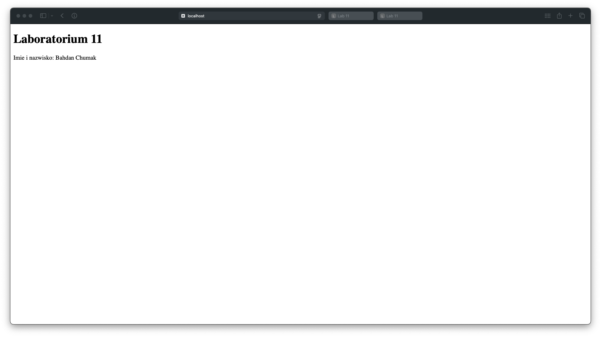

# Sprawozdanie – Laboratorium 11

## Temat

Uruchomienie trzech kontenerów z serwerem `nginx` w wersji `latest`:
- podłączonych do mostkowej sieci `lab11net`,
- wyświetlających stronę HTML zawierającą numer laboratorium oraz dane studenta,
- zapisujących logi w dedykowanych katalogach w systemie macierzystym.

## Struktura katalogów

```
lab11/
├── html/
│   └── index.html
└── logs/
    ├── web1/
    ├── web2/
    └── web3/
```

## Treść pliku HTML

```html
<!DOCTYPE html>
<html>
<head>
  <title>Lab 11</title>
</head>
<body>
  <h1>Laboratorium 11</h1>
  <p>Imię i nazwisko: Bahdan Chumak</p>
</body>
</html>
```

## Uzyte polecenia

# 1. Tworzenie sieci

```bash
docker network create --driver bridge lab11net
```

# 2. Uruchomienie kontenerow

```bash
docker run -d --name web1 --network lab11net \
  -p 8181:80 \
  -v "/Users/bogdancumak/Documents/Studia/6 semestr/Chmurza Obliczeniowa/lab11/html:/usr/share/nginx/html:ro" \
  -v "/Users/bogdancumak/Documents/Studia/6 semestr/Chmurza Obliczeniowa/lab11/logs/web1:/var/log/nginx" \
  nginx:latest

docker run -d --name web2 --network lab11net \
  -p 8182:80 \
  -v "/Users/bogdancumak/Documents/Studia/6 semestr/Chmurza Obliczeniowa/lab11/html:/usr/share/nginx/html:ro" \
  -v "/Users/bogdancumak/Documents/Studia/6 semestr/Chmurza Obliczeniowa/lab11/logs/web2:/var/log/nginx" \
  nginx:latest

docker run -d --name web3 --network lab11net \
  -p 8183:80 \
  -v "/Users/bogdancumak/Documents/Studia/6 semestr/Chmurza Obliczeniowa/lab11/html:/usr/share/nginx/html:ro" \
  -v "/Users/bogdancumak/Documents/Studia/6 semestr/Chmurza Obliczeniowa/lab11/logs/web3:/var/log/nginx" \
  nginx:latest
```

# 3. Weryfikacja dzialania

Screenshot z zawartoscią strony przy uruchomieniu http://localhost:8181/ w przeglądarce:



Sprawdzenie logow:

```bash
cat logs/web1/access.log
192.168.65.1 - - [25/May/2025:18:54:38 +0000] "GET / HTTP/1.1" 200 184 "-" "Mozilla/5.0 (Macintosh; Intel Mac OS X 10_15_7) AppleWebKit/605.1.15 (KHTML, like Gecko) Version/18.5 Safari/605.1.15" "-"
192.168.65.1 - - [25/May/2025:18:54:38 +0000] "GET /favicon.ico HTTP/1.1" 404 153 "http://localhost:8181/" "Mozilla/5.0 (Macintosh; Intel Mac OS X 10_15_7) AppleWebKit/605.1.15 (KHTML, like Gecko) Version/18.5 Safari/605.1.15" "-"
192.168.65.1 - - [25/May/2025:18:54:49 +0000] "GET / HTTP/1.1" 200 184 "-" "Mozilla/5.0 (Macintosh; Intel Mac OS X 10_15_7) AppleWebKit/605.1.15 (KHTML, like Gecko) Version/18.5 Safari/605.1.15" "-"
192.168.65.1 - - [25/May/2025:18:54:52 +0000] "GET / HTTP/1.1" 200 183 "-" "Mozilla/5.0 (Macintosh; Intel Mac OS X 10_15_7) AppleWebKit/605.1.15 (KHTML, like Gecko) Version/18.5 Safari/605.1.15" "-"
```

```bash
at logs/web2/access.log
192.168.65.1 - - [25/May/2025:18:56:31 +0000] "GET / HTTP/1.1" 200 183 "-" "Mozilla/5.0 (Macintosh; Intel Mac OS X 10_15_7) AppleWebKit/605.1.15 (KHTML, like Gecko) Version/18.5 Safari/605.1.15" "-"
192.168.65.1 - - [25/May/2025:18:56:31 +0000] "GET /favicon.ico HTTP/1.1" 404 153 "http://localhost:8182/" "Mozilla/5.0 (Macintosh; Intel Mac OS X 10_15_7) AppleWebKit/605.1.15 (KHTML, like Gecko) Version/18.5 Safari/605.1.15" "-"
```

```bash
cat logs/web3/access.log
192.168.65.1 - - [25/May/2025:18:56:36 +0000] "GET / HTTP/1.1" 200 183 "-" "Mozilla/5.0 (Macintosh; Intel Mac OS X 10_15_7) AppleWebKit/605.1.15 (KHTML, like Gecko) Version/18.5 Safari/605.1.15" "-"
192.168.65.1 - - [25/May/2025:18:56:36 +0000] "GET /favicon.ico HTTP/1.1" 404 153 "http://localhost:8183/" "Mozilla/5.0 (Macintosh; Intel Mac OS X 10_15_7) AppleWebKit/605.1.15 (KHTML, like Gecko) Version/18.5 Safari/605.1.15" "-"
```

Status kontenerow:

```bash
docker ps
CONTAINER ID   IMAGE          COMMAND                  CREATED         STATUS         PORTS                  NAMES
6194199cbf3c   nginx:latest   "/docker-entrypoint.…"   2 minutes ago   Up 2 minutes   0.0.0.0:8183->80/tcp   web3
dc37fba1670b   nginx:latest   "/docker-entrypoint.…"   3 minutes ago   Up 3 minutes   0.0.0.0:8182->80/tcp   web2
13f6f683c5a6   nginx:latest   "/docker-entrypoint.…"   3 minutes ago   Up 3 minutes   0.0.0.0:8181->80/tcp   web1
```

Inspekcja sieci:

```bash
docker network inspect lab11net
[
    {
        "Name": "lab11net",
        "Id": "c76a4fbedaf94c09f85defe43740e31bb1565872ea3891f3141ea9ac7c5d972b",
        "Created": "2025-05-25T16:27:46.681609087Z",
        "Scope": "local",
        "Driver": "bridge",
        "EnableIPv4": true,
        "EnableIPv6": false,
        "IPAM": {
            "Driver": "default",
            "Options": {},
            "Config": [
                {
                    "Subnet": "172.19.0.0/16",
                    "Gateway": "172.19.0.1"
                }
            ]
        },
        "Internal": false,
        "Attachable": false,
        "Ingress": false,
        "ConfigFrom": {
            "Network": ""
        },
        "ConfigOnly": false,
        "Containers": {
            "13f6f683c5a66252ac117119f562898b6a9bc4e2a8093df672ab62cb4d9d46c6": {
                "Name": "web1",
                "EndpointID": "46151b860e545ea0934c1b07083f228cb1b2aafd41605bd796b68762513b0724",
                "MacAddress": "aa:b3:6f:20:a1:5d",
                "IPv4Address": "172.19.0.2/16",
                "IPv6Address": ""
            },
            "6194199cbf3c3f72bfcb25ac2912748ec4eac1cde61967ecdf4f31e587feae59": {
                "Name": "web3",
                "EndpointID": "8ba8eb5925e19eebad6758523bf423d98cb59cdbdf12a9c25d326480c48dce79",
                "MacAddress": "2a:55:08:45:38:db",
                "IPv4Address": "172.19.0.4/16",
                "IPv6Address": ""
            },
            "dc37fba1670b1d6e2e46590c2c3a8f614c67d9a33bcd0d0cc74f19fe166bebb7": {
                "Name": "web2",
                "EndpointID": "5f724e96028fc65a1c2cbb89855e4aef0f0d169ec40f808540c2d4fe4cf5686a",
                "MacAddress": "2e:3e:f8:24:aa:37",
                "IPv4Address": "172.19.0.3/16",
                "IPv6Address": ""
            }
        },
        "Options": {
            "com.docker.network.enable_ipv4": "true",
            "com.docker.network.enable_ipv6": "false"
        },
        "Labels": {}
    }
]
```


## Podsumowanie:

	•	Kontenery działają poprawnie.
	•	HTML wyświetla dane.
	•	Logi zapisywane do przypisanych katalogów.
	•	Sieć mostkowa działa zgodnie z założeniem.